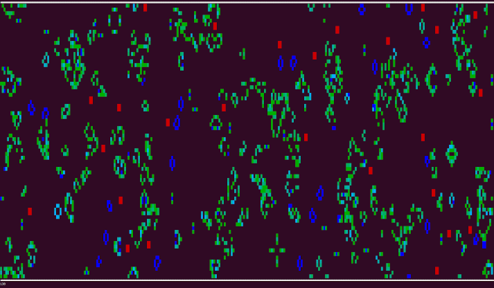
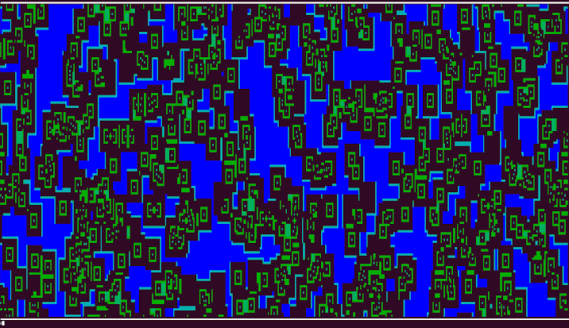

## Conway's Game of Life in Rust

### Features

- Terminal graphics
- Specify custom amount of columns and rows (`-c <number>`, `-r <number>`)
- Color cells by age
- Configurable speed in milliseconds (`-t <number>`)
- Multiple initialization modes (`--init [random|empty|gauss]`)
- Terminal high resolution mode (`-x`)
- Mark patterns with red color (`-m <filepath>`)
- Insert patterns into canvas (`-i <filepath>`)
- Load .rle files
- Load .cells files
- Custom rules (`--rule <rule>`)

### Build 

```bash
cargo build --release
```

### Run

```
cd target/release
./cgol
```


### High Resolution Mode

Make the font size of your terminal very small (e.g. via `ctrl +/-`). Then:

```
./cgol -x
```


### Load Patterns

```
./cgol -i ../../patterns/glidergun.rle --init empty
```


### Mark Patterns in Random Output

```
./cgol -m ../../patterns/block.cells
```



### Custom Rules

Try some [well-known life-like cellular automata](https://www.conwaylife.com/wiki/Cellular_automaton#Well-known_life-like_cellular_automata)!

```
./cgol --rule B0/S8
```




