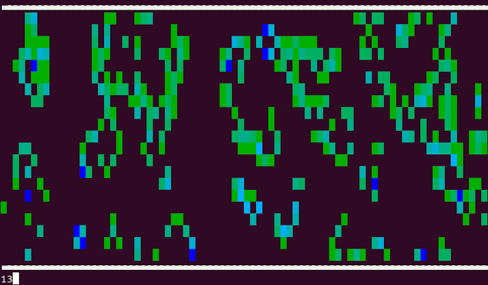
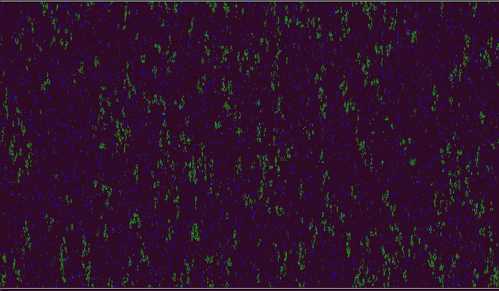
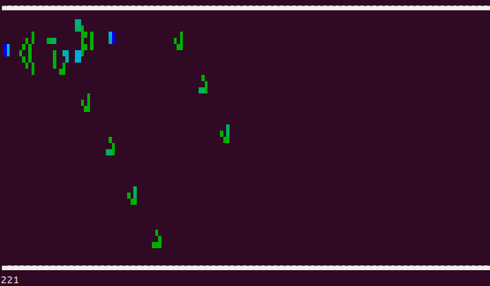

## Conway's Game of Life in Rust

### Build 

```bash
cargo build --release
```

### Run



```
cd target/release
./cgol
```

### Fullscreen

```
./cgol -c $COLUMNS -r $[ LINES-3 ] -t 30
```

### High Resolution Mode



```
./cgol -c $[ 2*COLUMNS ] -r $[ 2*LINES - 6 ] -t 30 -x
```

### Load Patterns



```
./cgol --mode empty -c $[ 2*COLUMNS ] -r $[ 2*LINES - 6 ] -t 10 -x -p ../../patterns/glidergun.cells -i
```

### Mark Patterns in Random Output

```
./cgol -c $[ COLUMNS ] -r $[ LINES - 3 ] -t 50 -p ../../patterns/glider.cells -i -m
```
